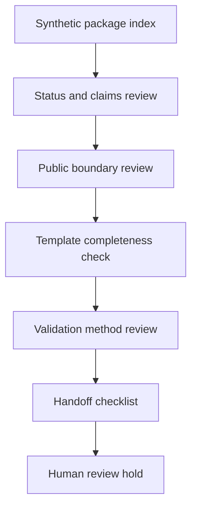

# Deliverable Package Index Template

Status: scaffolded

## Problem Statement

Engineering work needs a repeatable package index that names artifacts, review status, validation method, boundaries, and handoff posture without implying stamped engineering, certification, code compliance, legal approval, customer deliverables, safety approval, active service offerings, released models, released datasets, Space releases, or production readiness.

## Synthetic Deliverable Package Context

This template applies to synthetic public-safe engineering examples and scaffolded documentation packages. It does not represent a customer package or active client deliverable.

## Package Index Structure

| Package section | Template reference | Review status |
| --- | --- | --- |
| README | `readme-templates/engineering-repo-readme-template.md` | planned |
| STATUS | `status-templates/status-language-template.md` | planned |
| CLAIMS | `claims-templates/claims-register-template.md` | planned |
| PUBLIC_BOUNDARY | `boundary-templates/public-boundary-template.md` | planned |
| BOM | `bom-templates/public-safe-bom-template.csv` | planned |
| Control narrative | `control-narratives/control-narrative-template.md` | planned |
| Commissioning | `commissioning-templates/commissioning-template.md` | planned |
| Simulation report | `simulation-report-templates/simulation-report-template.md` | planned |
| Model card | `model-cards/model-card-template.md` | planned |
| Dataset card | `dataset-cards/dataset-card-template.md` | planned |
| Handoff | `handoff-checklists/engineering-handoff-checklist.md` | planned |

## Non-Stamped Engineering Boundary

Templates are review aids only. They do not create stamped engineering, legal approval, customer acceptance, safety approval, or production readiness.

## Mermaid Deliverable Review Flow

## Validation Questions

- Does the package avoid customer deliverables?
- Does it avoid production BOMs, production CAD, and production schematics?
- Does it avoid released model and released dataset claims?
- Does it avoid service offerings, pricing, and turnaround promises?
- Does it keep active client deliverables out?

## What This Proves

This proves a public-safe index structure for scaffolded engineering deliverable templates.

## What This Does Not Prove

This does not prove stamped engineering, certification, code compliance, legal approval, safety approval, customer delivery, production readiness, release status, or active service availability.

## Public / Private / Sealed Checklist

| Boundary | Status |
| --- | --- |
| Synthetic template only | scaffolded |
| Customer data absent | review |
| Foundation-private data absent | review |
| Secrets absent | review |
| Production procedures absent | review |
| Sealed source absent | review |
| Private model artifacts absent | review |
| Active client deliverables absent | review |
