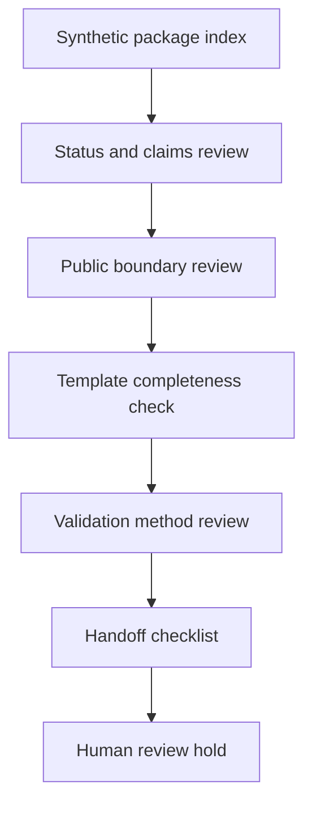

# Deliverable Package Index Template

Status: scaffolded

## Problem Statement

Engineering work needs a repeatable package index that names artifacts, review status, validation method, boundaries, and handoff posture without implying stamped engineering, certification, code compliance, legal approval, customer deliverables, safety approval, active service offerings, released models, released datasets, Space releases, or production readiness.

## Synthetic Engineering Deliverable Context

This template applies to synthetic public-safe engineering examples and scaffolded documentation packages. It does not represent a customer package or active client deliverable.

The synthetic package context assumes invented artifacts, placeholder sections, and review-only status. It may be used to organize public-safe documentation discipline, not to deliver customer work or offer a service.

## README / STATUS / CLAIMS / PUBLIC_BOUNDARY Template Discipline

| Template area | Required discipline | Boundary |
| --- | --- | --- |
| README | State scope, exclusions, tools, artifacts, validation, and current status | No product, service, or customer claim |
| STATUS | Use approved labels only | No release claim without reviewed evidence |
| CLAIMS | Tie every claim to evidence and limits | No unsupported outcome claim |
| PUBLIC_BOUNDARY | Name public, private, sealed, customer, Foundation, and model/data limits | No private or sealed disclosure |

## Package Index Structure

| Package section | Template reference | Review status |
| --- | --- | --- |
| README | `readme-templates/engineering-repo-readme-template.md` | planned |
| STATUS | `status-templates/status-language-template.md` | planned |
| CLAIMS | `claims-templates/claims-register-template.md` | planned |
| PUBLIC_BOUNDARY | `boundary-templates/public-boundary-template.md` | planned |
| BOM | `bom-templates/public-safe-bom-template.csv` | planned |
| Control narrative | `control-narratives/control-narrative-template.md` | planned |
| Commissioning | `commissioning-templates/commissioning-template.md` | planned |
| Simulation report | `simulation-report-templates/simulation-report-template.md` | planned |
| Model card | `model-cards/model-card-template.md` | planned |
| Dataset card | `dataset-cards/dataset-card-template.md` | planned |
| Handoff | `handoff-checklists/engineering-handoff-checklist.md` | planned |

## BOM / Control Narrative / Commissioning / Simulation / Model-Card / Dataset-Card Template Boundaries

| Template | Public-safe content | Held content |
| --- | --- | --- |
| BOM | Synthetic table shape and boundary notes | Production BOMs, sourcing, customer hardware |
| Control narrative | Generic state and signal categories | Live control logic or customer systems |
| Commissioning | Review-only step structure | Production procedures or live commissioning records |
| Simulation report | Synthetic inputs, model boundary, proof limits | Benchmark claims, production readiness, private measurements |
| Model card | Release-surface placeholder fields | Released model claims, private weights, private corpora |
| Dataset card | Dataset-card structure and privacy notes | Released dataset claims, customer data, Foundation-private data |

## Handoff Checklist

| Handoff area | Required field | Review status |
| --- | --- | --- |
| Scope | Synthetic package overview | planned |
| Artifact list | File paths and statuses | planned |
| Claims register | Evidence, limits, and forbidden claims | planned |
| Boundary register | Public/private/sealed notes | planned |
| Validation log | Checks run and unresolved items | planned |
| Human review | Reviewer decision and held items | planned |

## Non-Certified / Non-Stamped Disclaimer

Templates are review aids only. They do not create certification, stamped engineering, code compliance approval, legal approval, customer acceptance, safety approval, production readiness, active service offerings, pricing, turnaround promises, model releases, dataset releases, or Space releases.

## Mermaid Deliverable Review Flow

## Validation Questions

- Does the package avoid customer deliverables?
- Does it avoid production BOMs, production CAD, and production schematics?
- Does it avoid released model and released dataset claims?
- Does it keep model-card and dataset-card content as templates only?
- Does it avoid service offerings, pricing, and turnaround promises?
- Does it keep active client deliverables out?
- Does it include README, STATUS, CLAIMS, and PUBLIC_BOUNDARY discipline?
- Does it include a handoff checklist and proof-limit language?

## What This Proves

This proves a public-safe index structure for scaffolded engineering deliverable templates, including repo documentation discipline, package indexing, template boundaries, handoff review fields, validation questions, and proof-limit language.

## What This Does Not Prove

This does not prove stamped engineering, certification, code compliance, legal approval, safety approval, customer delivery, production readiness, model release, dataset release, Space release, release status, active service availability, pricing, or turnaround commitments.

## Public / Private / Sealed Checklist

| Boundary | Status |
| --- | --- |
| Synthetic template only | scaffolded |
| Customer data absent | review |
| Foundation-private data absent | review |
| Secrets absent | review |
| Production procedures absent | review |
| Sealed source absent | review |
| Private model artifacts absent | review |
| Active client deliverables absent | review |
